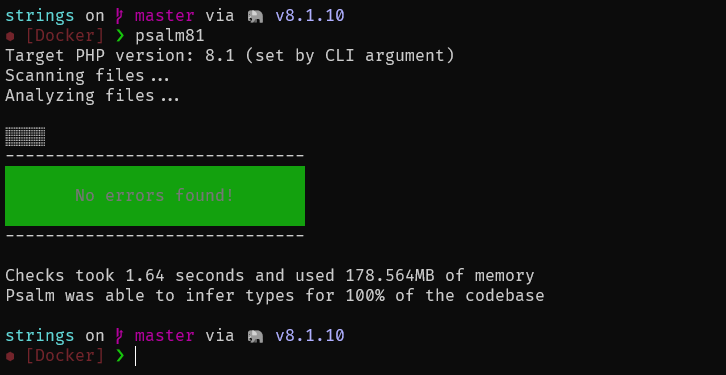

# `vjik/dev-php` Docker Image

PHP docker image for local development that include:

- PHP with extensions:
  [intl](https://www.php.net/manual/book.intl.php),
  [Gettext](https://www.php.net/manual/book.gettext.php),
  [OPcache](https://www.php.net/manual/book.opcache.php),
  [Sockets](https://www.php.net/manual/book.sockets.php),
  [uopz](https://www.php.net/manual/book.uopz.php),
  [PDO PostgreSQL](https://www.php.net/manual/ref.pdo-pgsql.php),
  [APCu](https://www.php.net/manual/book.apcu.php)
- [Node.js](https://nodejs.org/)
- Bash terminal with [predefined aliases](#aliases)
- [Starship shell prompt](https://starship.rs/)
- [Composer](https://getcomposer.org/) with [completion](https://getcomposer.org/doc/03-cli.md#bash-completions)
- [GIT](https://git-scm.com/)
- [GnuPG](https://www.gnupg.org/) for sign commits
- OpenSSH authentication agent (`ssh-agent`)



## General usage

### Pull image from DockerHub

[Image on DockerHub](https://hub.docker.com/r/vjik/dev-php), docker pull command:

```shell
docker pull vjik/dev-php:8.1
```

Tags are named by PHP version used: `8.1`, `8.0`, `7.4`.

### Run container

Recommended run command:

```shell
docker run -it --rm --name dev-php -v /host/projects:/projects -w /projects vjik/dev-php:8.1 --uname vjik --uid 1000 --gname vjik -gid 1000
```

- `-it` — Interactive mode with allocate a pseudo terminal.
- `--rm` — Automatically remove the container when it exits.
- `--name dev-php` — Assign name "dev-php" to the container.
- `-v /host/projects:/projects` — Mount folder with your projects (replace `/host/projects` to your path) to container
  (`/projects`).
- `-w /projects` — Set `/projects` as working directory inside the container.
- `vjik/dev-php:8.1` — Image name.
- `--uname vjik` — Set username in container.
- `--uid 1000` — Set user ID in container.
- `--gname vjik` — Set user group name in container.
- `--gid 1000` — Set user group ID in container.

Recommended to use the same username and group as in your system.

#### SSH configuration

You can configure SSH in container via mount folder with SSH configuration to path `/config/.ssh`. To do this, add the
appropriate argument to the container run command. For example:

`-v ~/.ssh:/config/.ssh`

#### GIT configuration

You can configure GIT in container via mount configuration file `.gitconfig` to path `/config/.gitconfig`. To do this, 
add the appropriate argument to the container run command. For example:

`-v ~/.gitconfig:/config/.gitconfig`

#### GnuPG configuration

You can configure GnuPG in container via mount folder with GnuPG configuration to path `/config/.gnupg`. To do this, add the
appropriate argument to the container run command. For example:

`-v ~/dev-gnupg:/config/.gnupg`

Recommend don't use system `.gnupg` directory. Better create new directory and mount it.

To request passphrase in terminal add `pinentry-mode loopback` option to `gpg.conf` file (create if not exist).

## Features

### Aliases

| Alias   | Command                                         |
|---------|-------------------------------------------------|
| c       | composer                                        |
| cu      | composer update                                 |
| pu      | ./vendor/bin/phpunit                            |
| puc     | ./vendor/bin/phpunit --coverage-html=cover      |
| puct    | ./vendor/bin/phpunit --coverage-text            |
| puf     | ./vendor/bin/phpunit --filter                   |
| psalm   | ./vendor/bin/psalm --no-cache                   |
| psalm74 | ./vendor/bin/psalm --no-cache --php-version=7.4 |
| psalm80 | ./vendor/bin/psalm --no-cache --php-version=8.0 |
| psalm81 | ./vendor/bin/psalm --no-cache --php-version=8.1 |
| psalm82 | ./vendor/bin/psalm --no-cache --php-version=8.2 |
| cls     | clear                                           |

## Build an image

Use [Task](https://taskfile.dev/) for simplify run:

```shell
task build74 # PHP 7.4
task build80 # PHP 8.0
task build81 # PHP 8.1
task build82 # PHP 8.2
```
